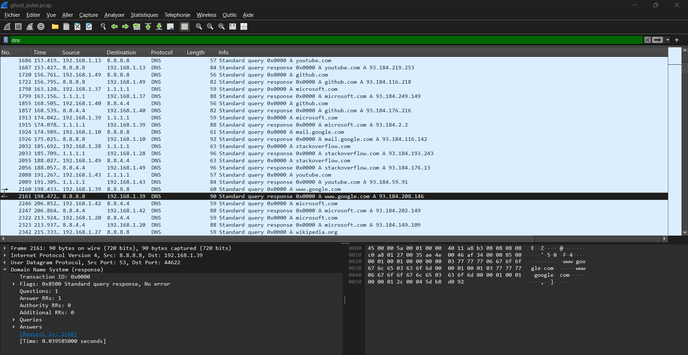
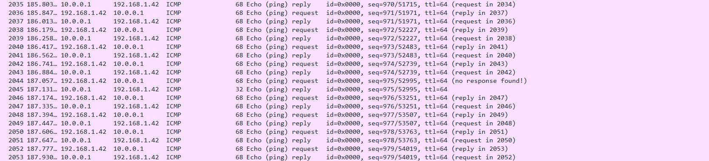
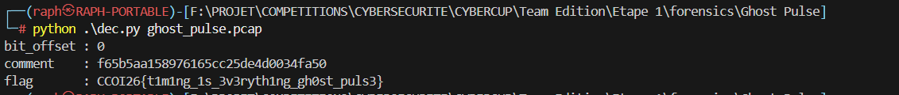

# Writeup — Ghost Pulse

## Fichier fourni

Un fichier de capture réseau : [`ghost_pulse.pcap`](./ghost_pulse.pcap)

---

## Analyse initiale

En ouvrant la capture dans Wireshark, on observe trois protocoles qui se répètent : **HTTP**, **DNS** et **ICMP**.

### HTTP

Le trafic HTTP contient un grand nombre de requêtes vers des sites officiels et connus :
`youtube.com`, `github.com`, `reddit.com`, `google.com`, `mail.google.com`, `cloudflare.com`, `stackoverflow.com`, etc.

Le pattern est répétitif et systématique pour chaque domaine :
- Résolution DNS du domaine
- Requête `GET /`
- Requête `GET /index.html`
- Requête `GET /robots.txt`
- Requête `GET /api/status`


L'analyse de ces requêtes ne révèle rien d'anormal : aucune modification suspecte, uniquement des sites légitimes, ce qui corrobore l'absence de contenu malveillant mentionnée dans le sujet.

---

### DNS

On examine ensuite toutes les requêtes et réponses DNS : sources, résolutions, redirections éventuelles, comportement du côté de Cloudflare… Rien d'inhabituel. Cette piste est abandonnée.



---

## ICMP

On se concentre sur le protocole ICMP. On observe un volume important de paquets `Echo (ping) request` et `Echo (ping) reply` transitant entre `10.0.0.1` et `192.168.1.42`, avec des **numéros de séquence très aléatoires** mais un **TTL parfaitement constant**.



À première vue, rien de suspect dans le contenu des paquets.

Mais en cherchant plus loin, on remarque dans le trafic **ICMP** (les pings) que toutes les ~50 réponses, le payload change. Au lieu du contenu classique `101112131415...3637` (après extraction avec tshark = `tshark -r ghost_pulse.pcap  -Y "icmp" -T fields -e frame.number -e ip.src -e ip.dst -e icmp.type -e icmp.code -e data.data > icmp.txt`), un payload différent apparaît — par exemple `51304e5053513d3d` à la ligne `51`.

En décodant ce payload en trois étapes :
1. **Hex → ASCII** : `51304e5053513d3d` → `Q0NPSQ==`
2. **Base64 → texte** : `Q0NPSQ==` → `CCOI`

En récupérant tous ces chunks et en les recollant dans l'ordre, le flag apparaît :

**`CCOI26{n1c3_try_but_d1g_d33p3r}`**

Mais c'est pas le bon flag il parait.

Mais le **second hint** du challenge change tout :

> **"time threshold, What is it?"**

Ce hint indique que l'information n'est pas dans le *payload* des paquets ICMP, mais dans le **rythme** auquel ils sont émis — plus précisément dans les **intervalles de temps (deltas)** entre chaque paquet consécutif.

---

## Reconstruction du canal covert

Le principe est le suivant :

1. On calcule le **delta temporel** entre chaque paquet ICMP consécutif.
2. On définit un **threshold** (seuil) fixe à `0.1s` comme valeur de séparation.
3. On encode chaque delta en bit :
   - `delta < threshold` → bit `0`
   - `delta >= threshold` → bit `1`
4. On reconstitue les octets (8 bits par octet) et on tente une **décompression zlib**.
5. Si le résultat commence par la signature PNG `\x89PNG`, on a reconstruit une image cachée.

Le script essaie automatiquement plusieurs **offsets de bit** (0 à 7) pour trouver le bon alignement.

### Extraction du PNG

En appliquant ce principe, on extrait une image PNG cachée dans le canal temporel :

```python
#!/usr/bin/env python3
import struct, sys, zlib

PNG_SIG = b"\x89PNG\r\n\x1a\n"


def parse_pcap(path):
    with open(path, "rb") as f:
        gh = f.read(24)
        e = "<" if gh[:4] == b"\xd4\xc3\xb2\xa1" else ">"
        *_, link_type = struct.unpack(e + "IHHIIII", gh)
        while True:
            ph = f.read(16)
            if not ph: break
            ts_sec, ts_usec, incl_len, _ = struct.unpack(e + "IIII", ph)
            data = f.read(incl_len)
            if link_type == 228:
                raw = data
            elif link_type == 1:
                if len(data) < 14 or struct.unpack("!H", data[12:14])[0] != 0x0800: continue
                raw = data[14:]
            yield ts_sec + ts_usec / 1e6, raw


def parse_ipv4(pkt):
    if len(pkt) < 20: return None
    ihl = (pkt[0] & 0x0F) * 4
    total = min(struct.unpack("!H", pkt[2:4])[0], len(pkt))
    return {"proto": pkt[9], "payload": pkt[ihl:total]}


def get_icmp_timestamps(pcap_path):
    ts_list = []
    for ts, raw in parse_pcap(pcap_path):
        ip = parse_ipv4(raw)
        if ip and ip["proto"] == 1 and len(ip["payload"]) >= 8:
            ts_list.append(ts)
    return ts_list


def extract_png(pcap_path, out_path, threshold=0.1):
    ts = get_icmp_timestamps(pcap_path)
    bits = "".join("0" if ts[i] - ts[i-1] < threshold else "1" for i in range(1, len(ts)))

    for offset in range(8):
        chunk = bits[offset:]
        raw = bytes(int(chunk[i:i+8], 2) for i in range(0, (len(chunk)//8)*8, 8))
        try:
            data = zlib.decompress(raw)
            if data.startswith(PNG_SIG):
                with open(out_path, "wb") as f:
                    f.write(data)
                print(f"[+] PNG extrait ({len(data)} bytes) → {out_path}  [bit_offset={offset}]")
                return
        except Exception:
            continue

    print("[!] PNG non trouvé dans le canal temporel.")


if __name__ == "__main__":
    pcap = sys.argv[1] if len(sys.argv) > 1 else "ghost_pulse.pcap"
    out  = sys.argv[2] if len(sys.argv) > 2 else "hidden.png"
    extract_png(pcap, out)
```

L'image extraite affiche :


**"ACCESS DENIED — Try Harder!"** — une autre fausse piste visuelle, mais le fichier PNG lui-même contient des données cachées qu'on ne voit pas à l'œil nu.

---

### Ce que cache vraiment le PNG

En analysant les chunks du fichier PNG, on découvre deux éléments dissimulés :

- Un chunk **`tEXt → Comment`** contenant une valeur hexadécimale : c'est la **seconde moitié de la clé XOR**.
- Des **données ajoutées après le chunk `IEND`** (normalement la fin d'un PNG) : un **script Python stocké à l'envers**, contenant `ENCRYPTED` (le flag chiffré) et `PARTIAL_KEY` (la **première moitié de la clé XOR**).

### Modifications apportées au script

Le premier script s'arrêtait après l'extraction du PNG. Pour aller plus loin, on lui ajoute trois étapes :

- **`parse_png`** : lit les chunks PNG pour récupérer le champ `Comment` et les données après `IEND`.
- **`extract_stage3`** : inverse les données après `IEND` et en extrait `ENCRYPTED` et `PARTIAL_KEY` par regex.
- **`xor_decrypt`** : reconstruit la clé complète (`PARTIAL_KEY + Comment`) et déchiffre le flag par XOR.

---

## Script de résolution final

```python
#!/usr/bin/env python3
import ast, re, struct, sys, zlib

PNG_SIG = b"\x89PNG\r\n\x1a\n"


def parse_pcap(path):
    with open(path, "rb") as f:
        gh = f.read(24)
        e = "<" if gh[:4] == b"\xd4\xc3\xb2\xa1" else ">"
        *_, link_type = struct.unpack(e + "IHHIIII", gh)
        while True:
            ph = f.read(16)
            if not ph: break
            ts_sec, ts_usec, incl_len, _ = struct.unpack(e + "IIII", ph)
            data = f.read(incl_len)
            if link_type == 228:
                raw = data
            elif link_type == 1:
                if len(data) < 14 or struct.unpack("!H", data[12:14])[0] != 0x0800: continue
                raw = data[14:]
            yield ts_sec + ts_usec / 1e6, raw


def parse_ipv4(pkt):
    if len(pkt) < 20: return None
    ihl = (pkt[0] & 0x0F) * 4
    total = min(struct.unpack("!H", pkt[2:4])[0], len(pkt))
    return {"proto": pkt[9], "src": ".".join(str(b) for b in pkt[12:16]),
            "dst": ".".join(str(b) for b in pkt[16:20]), "payload": pkt[ihl:total]}


def get_icmp_timestamps(pcap_path):
    ts_list = []
    for ts, raw in parse_pcap(pcap_path):
        ip = parse_ipv4(raw)
        if ip and ip["proto"] == 1 and len(ip["payload"]) >= 8:
            ts_list.append(ts)
    return ts_list


def timing_to_png(pcap_path, threshold=0.1):
    ts = get_icmp_timestamps(pcap_path)
    bits = "".join("0" if ts[i] - ts[i-1] < threshold else "1" for i in range(1, len(ts)))
    for offset in range(8):
        chunk = bits[offset:]
        raw = bytes(int(chunk[i:i+8], 2) for i in range(0, (len(chunk)//8)*8, 8))
        try:
            data = zlib.decompress(raw)
            if data.startswith(PNG_SIG):
                return data, offset
        except Exception:
            continue
    raise ValueError("PNG not found in timing channel.")


def parse_png(png_bytes):
    pos, meta, tail = 8, {}, b""
    while True:
        length = struct.unpack("!I", png_bytes[pos:pos+4])[0]
        c_type = png_bytes[pos+4:pos+8]
        chunk_data = png_bytes[pos+8:pos+8+length]
        if c_type == b"tEXt" and b"\x00" in chunk_data:
            k, v = chunk_data.split(b"\x00", 1)
            meta[k.decode("latin1")] = v.decode("latin1")
        pos += 12 + length
        if c_type == b"IEND":
            tail = png_bytes[pos:]
            break
    return meta, tail


def extract_stage3(tail):
    text = tail[::-1].decode("utf-8")
    encrypted = ast.literal_eval(re.search(r"ENCRYPTED\s*=\s*(b'.*?')", text, re.DOTALL).group(1))
    partial_key = ast.literal_eval(re.search(r"PARTIAL_KEY\s*=\s*(b'.*?')", text, re.DOTALL).group(1))
    return bytes(encrypted), bytes(partial_key)


def xor_decrypt(data, key):
    return bytes(data[i] ^ key[i % len(key)] for i in range(len(data)))


def main():
    pcap_path = sys.argv[1]
    png_bytes, bit_offset = timing_to_png(pcap_path)

    if len(sys.argv) >= 3:
        open(sys.argv[2], "wb").write(png_bytes)

    meta, tail = parse_png(png_bytes)
    encrypted, partial_key = extract_stage3(tail)
    full_key = partial_key + bytes.fromhex(meta["Comment"])
    flag = xor_decrypt(encrypted, full_key).decode("utf-8")

    print(f"bit_offset : {bit_offset}")
    print(f"comment    : {meta['Comment']}")
    print(f"flag       : {flag}")


if __name__ == "__main__":
    main()
```

---

## Résultat



```
CCOI26{t1m1ng_1s_3v3ryth1ng_gh0st_puls3}
```